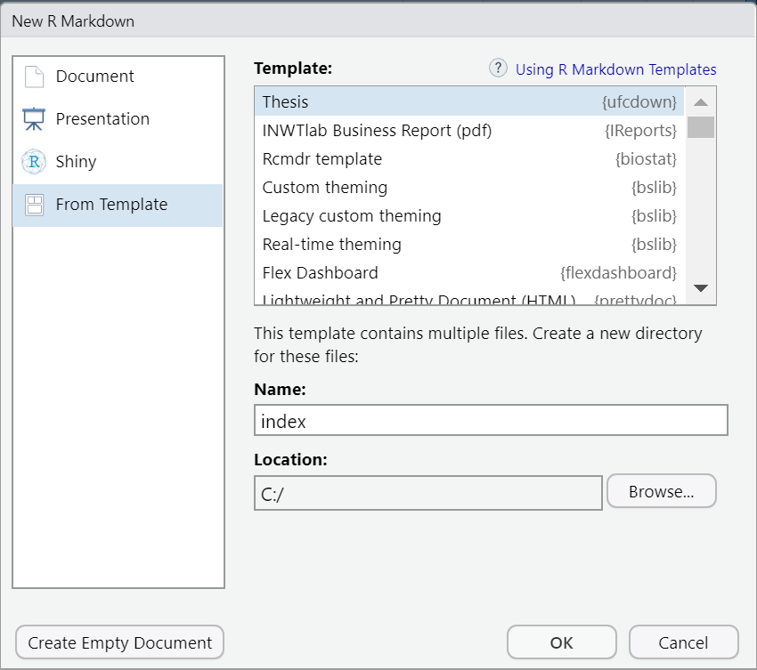

<!-- README.md is generated from README.Rmd. Please edit that file -->

# ufcdown

<!-- badges: start -->

[](https://lifecycle.r-lib.org/articles/stages.html#stable)
<!-- badges: end -->

This project was inspired by the
[thesisdown](https://github.com/ismayc/thesisdown) package. De facto,
`ufcdown` (as well as `thesisdown`) is only a customization of the
[bookdown](https://github.com/rstudio/bookdown) package. `ufcdown`
customizes bookdown to the
[UFC](https://biblioteca.ufc.br/pt/servicos-e-produtos/templates/)
format. Check out this
[link](https://github.com/ismayc/thesisdown#customizing-thesisdown-to-your-institution)
for other examples.

Currently, the PDF version is fully-functional. The gitbook, word and
epub versions are developmental, have no templates behind them, and are
essentially calls to the appropriate functions in bookdown.

If you are new to working with `bookdown`/`rmarkdown`, please read over
the documentation available in the `gitbook` template at
<https://thesisdown.netlify.com/>. This is also available below at
<https://ismayc.github.io/thesisdown_book>.

The current output for the four versions is here:

-   [PDF](https://github.com/ismayc/thesisdown_book/blob/gh-pages/thesis.pdf)
    ( Generating LaTeX file is available
    [here](https://github.com/ismayc/thesisdown_book/blob/gh-pages/thesis.tex)
    with other files at in the [book
    directory](https://github.com/ismayc/thesisdown_book/tree/gh-pages).)
-   [Word](https://github.com/ismayc/thesisdown_book/blob/gh-pages/thesis.docx)
-   [ePub](https://github.com/ismayc/thesisdown_book/blob/gh-pages/thesis.epub)
-   [gitbook](https://ismayc.github.io/thesisdown_book)

Under the hood, the [UFC LaTeX template on
Overleaf](https://www.overleaf.com/read/csmhqmchyzzz) is used to ensure
that documents conform precisely to submission standards. At the same
time, composition and formatting can be done using lightweight
[markdown](https://rmarkdown.rstudio.com/authoring_basics.html) syntax,
and **R** code and its output can be seamlessly included using
[rmarkdown](https://rmarkdown.rstudio.com).

### Using ufcdown

Using **ufcdown** has some prerequisites which are described below. To
compile PDF documents using **R**, you are going to need to have LaTeX
installed. By far the easiest way to install LaTeX on any platform is
with the [tinytex](https://yihui.name/tinytex/) R package:

``` r
install.packages(c('tinytex', 'rmarkdown'))
tinytex::install_tinytex()
# after restarting RStudio, confirm that you have LaTeX with 
tinytex:::is_tinytex() 
```

You may need to install a few extra LaTeX packages on your first attempt
to knit as well. Here is one such example of how to do so:

``` r
tinytex::tlmgr_install("babel-portuges")
#> tlmgr update --all --self
#> tlmgr install babel-portuges
```

To use **ufcdown** from
[RStudio](http://www.rstudio.com/products/rstudio/download/):

1\) Ensure that you have already installed LaTeX and the fonts described
above, and are using the latest version of
[RStudio](http://www.rstudio.com/products/rstudio/download/). You can
use `ufcdown` without RStudio. For example, you can write the `Rmd`
files in your favourite text editor (e.g. [Atom](https://atom.io/),
[Notepad++](https://notepad-plus-plus.org/)). But RStudio is probably
the easiest tool for writing both R code and text in your thesis. It
also provides a nice way to build your thesis while editing. We’ll
proceed assuming that you have decided to use the RStudio workflow.

2\) Install the **bookdown** and **ufcdown** packages. Note that
**ufcdown** is not available on CRAN at the moment and that’s why
`install.packages("ufcdown")` won’t work. Use
`remotes::install_github()` as shown below instead to install the
package.

``` r
if (!require("remotes")) 
  install.packages("remotes", repos = "http://cran.rstudio.org")
remotes::install_github("damarals/ufcdown")
# or, if you wish, install all the suggested packages:
remotes::install_github("damarals/ufcdown", dependencies = TRUE)
```

Note that you may need to restart RStudio at this point for the
following dialog to show up.

3\) Use the **New R Markdown** dialog to select **Thesis**:



Note that this will currently only **Knit** if you name the directory
`index` as shown above.

4\) After choosing which type of output you’d like in the YAML at the
top of index.Rmd, **Knit** the `index.Rmd` file to get the book in PDF
formats.

### Day-to-day writing of your thesis

You need to edit the individual chapter R Markdown files to write your
thesis. It’s recommended that you version control your thesis using
GitHub if possible. RStudio can also easily sync up with GitHub to make
the process easier. While writing, you should `git commit` your work
frequently, after every major activity on your thesis. For example,
every few paragraphs or section of text, and after major step of
analysis development. You should `git push` at the end of each work
session before you leave your computer or change tasks. For a gentle,
novice-friendly guide to getting starting with using Git with R and
RStudio, see <http://happygitwithr.com/>.

## Rendering

To render your thesis into a PDF, open a powershell, terminal, git bash,
cmd, etc… in the same directory as the `index.Rmd` file and run the
`make` command. Tip: the `make` command can be given from the Rstudio
terminal (not console).

The `make` command is needed to correctly insert the glossary page. If
you are knitting (knit button) in Rstudio, the Thesis document in pdf
will be generated, but with the glossary page empty (blank page).

If you are using Windows, you can install GNU `make` with `chocolatey`,
a well-maintained package manager, which will add make to the global
path and runs on all CLIs (powershell, git bash, cmd, etc…) saving you a
ton of time in both maintenance and initial setup to get make running.

1.  Install the [chocolatey package manager for
    Windows](https://chocolatey.org/install) compatible to Windows 7+ /
    Windows Server 2003+

2.  Run `choco install make` in powershell, terminal, git bash, cmd,
    etc…

The PDF file of your thesis (`thesis.pdf`) will be deposited in the same
directory of `index.Rmd`, by default.

## Components

The following components are ones you should edit to customize your
thesis:

### `_bookdown.yml`

This is the main configuration file for your thesis. It determines what
Rmd files are included in the output, and in what order. Arrange the
order of your chapters in this file and ensure that the names match the
names in your folders.

### `index.Rmd`

This file contains all the meta information that goes at the beginning
of your document. You’ll need to edit this to put your name on the first
page, the title of your thesis, etc.

### `lib/`

The lib folder contains several style and .tex files like
`glossario.tex` and `lista-de-simbolos.tex`

These .tex files must be edited in latex format.

### `misc/`

The misc folder contains files of various extensions to be used in the
document, code files, pdfs, etc.

### `csl/`

Specific style files for bibliographies should be stored here. A good
source for citation styles is
<https://github.com/citation-style-language/styles#readme>

### `01-introducao.Rmd`, `02-trabalhos-relacionados.Rmd`, etc.

These are the Rmd files for each chapter in your dissertation. Write
your thesis in these. If you’re writing in RStudio, you may find the
[wordcount addin](https://github.com/benmarwick/wordcountaddin) useful
for getting word counts and readability statistics in R Markdown
documents.

### `bib/`

Store your bibliography (as bibtex files) here. We recommend using the
[citr addin](https://github.com/crsh/citr) and
[Zotero](https://www.zotero.org/) to efficiently manage and insert
citations.

### `figure/` and `data/`

Store your figures and data here and reference them in your R Markdown
files. See the [bookdown book](https://bookdown.org/yihui/bookdown/) for
details on cross-referencing items using R Markdown.
